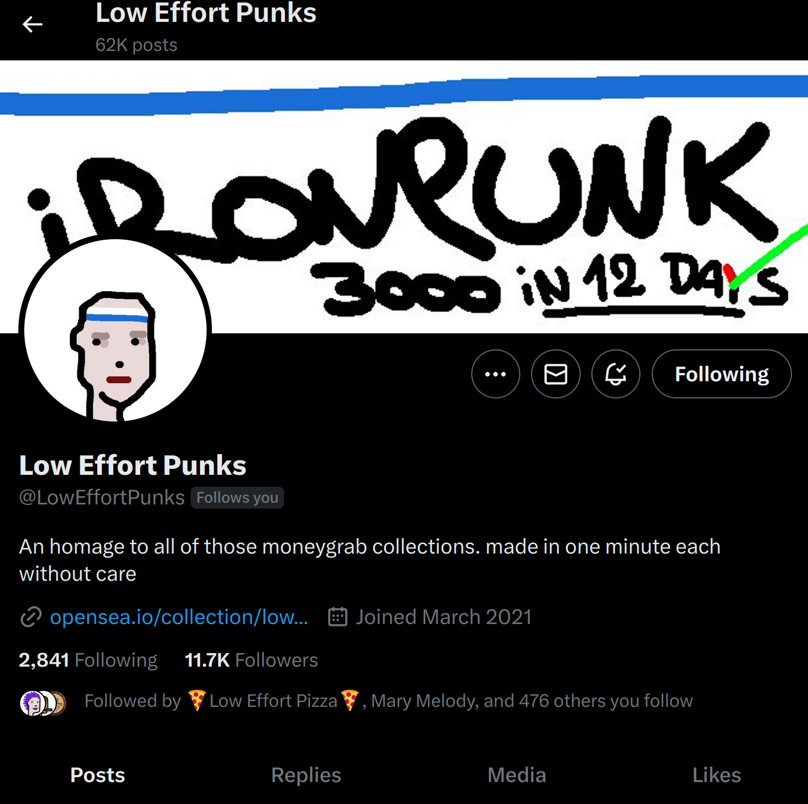

# #IRONPUNK

\[IRONPUNK] provides for a stark contrast to the languid pace of minting, the anarchic attitude underpinning LEP’s approach to creation. The #IRONPUNK era highlights the dedication required to maintain a consistent approach and aesthetic sensibility for as long as he has, while others chase trends. Truly remarkable to witness. **-BoomBoomNFT** 

**IRONPUNK started on Sept 19 following a sudden OpenSea announcement of the sunsetting of their Lazy Mint, which LEP was using at the time to make PUNK. He ran for glory basically.**

**first 1 ETH of LEP sales was sept 19 so thats when he decided to start IRONPUNK god mode challenge**

<figure><figcaption>
10/2/23 LEP's Twitter
</figcaption></figure>

<figure><figcaption>
All Time Volume up until the end of 10k (IRONPUNK at the end)
</figcaption></figure>

\
